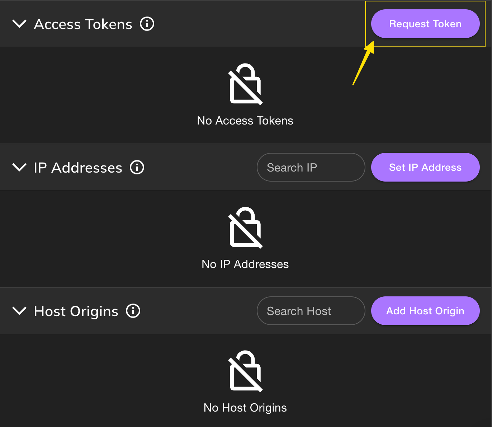
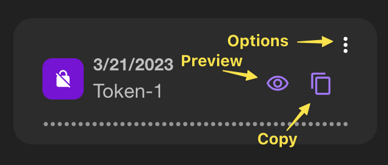
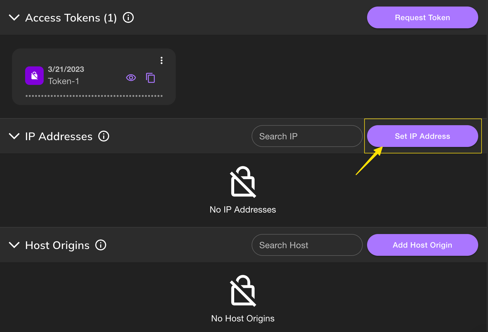
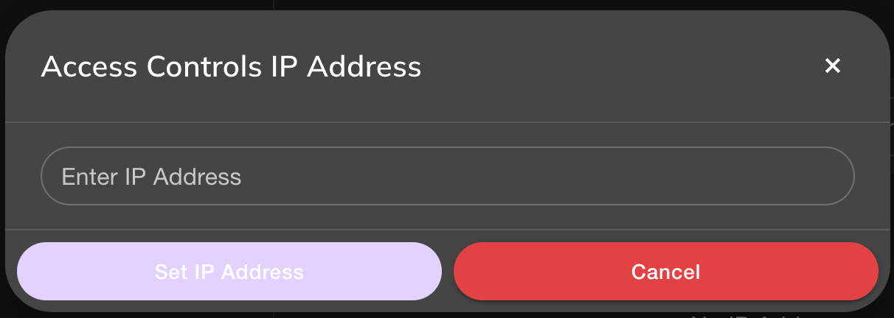
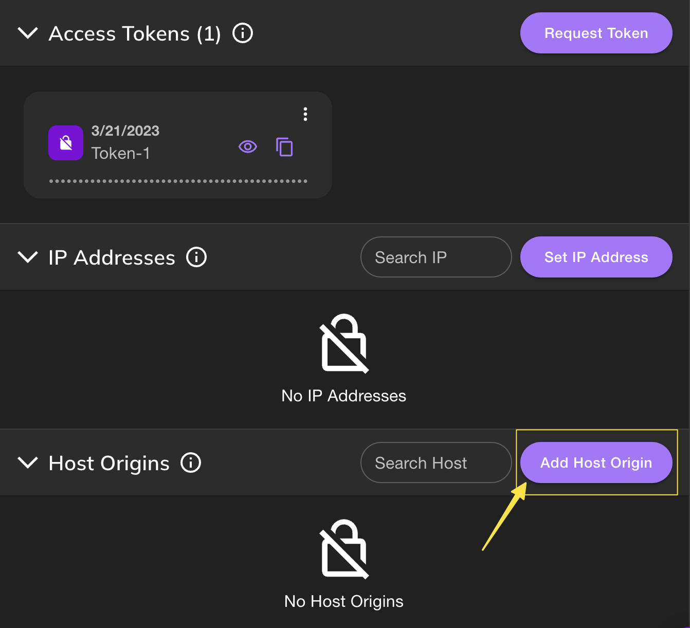
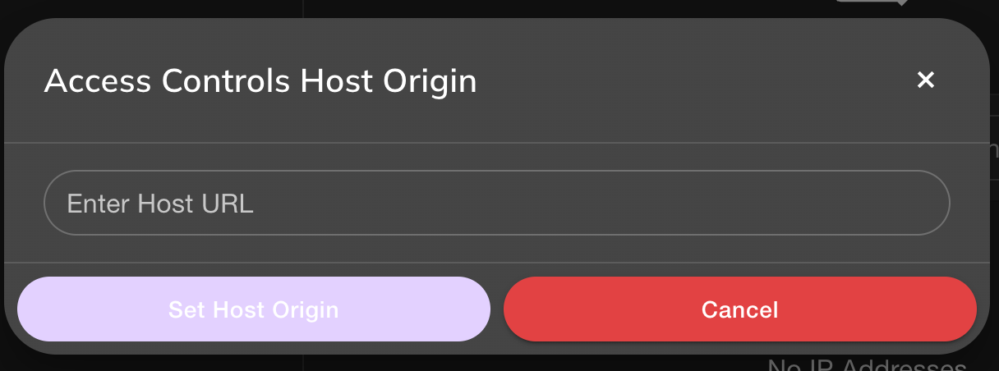

# Gateway Access Controls

Pinata's Dedicated Gateways make it possible to fetch and serve IPFS content quickly and reliably, however there can be security risks in exposing your gateway to the world. That is why Pinata has created Gateway Access Controls. These controls will allow you to further limit your gateway, making sure only your platform is using it. This is accomplished with **Access Tokens, IP Address Restrictions,** and **Host Origin Restrictions.**&#x20;

To start, make sure you visit the [Developers](https://app.pinata.cloud/developers/) page and click "Restrict Access".

By default, Dedicated Gateways are restricted with the lowest level restriction possible. They will only serve content that is pinned to your account. This restriction is helpful for creators and for those just getting started. But if you want to restrict access further, **or if you want to access IPFS content from the wider network that may not be pinned to your account, you'll need to add security restrictions.**&#x20;

### Access Tokens

Adding an access token restriction means that content served through your gateway will only be served successfully if the access token is present with the request. **Importantly, you should note that even if the content is pinned to your account, it will not longer serve through your gateway if you have added an access token restriction and don't include that token in requests for content.**&#x20;

To create an access token, click on the button that says "Request Token."



When you create an access token you will have the ability to preview the token by clicking the "eye" icon, or copy the token to your clipboard with the "copy" icon. At any point you can delete an access token by clicking the three small dots on the right.



Once you have the token, there are two ways you can use it in the gateway request.&#x20;

#### Query Parameter

To use the query parameter method, simply add this to the end of a gateway request url:

```
?pinataGatewayToken=PASTE_IN_ACCESS_TOKEN
```

#### Header

Another way to use the access token is in the request header. The Key Value would look like this:

| Key                    | Value         |
| ---------------------- | ------------- |
| x-pinata-gateway-token | ACCESS\_TOKEN |

**Please keep in mind that using the access token in the request header may not work in a client side application, consider using IP Address restriction instead for those use cases.**

### IP Address

You can also restrict your gateway by IP Address. You can add up to 100 different IP addresses (individually). When you add this restriction, only content requested from an IP address that you've added will be served through your gateway.&#x20;

To start click "Set IP Address" on the right side of the menu.



You will get window asking for a valid IP Address that will allow any requests being made from the IP Address to go through!



### Host Origin;

With the Host Origin restriction you can make sure your gateway can only be used on a specific Domain like app.pinata.cloud. To get started, click on "Add Host Origin."



After that you can add the domain you would like your gateway to be used from!



Keep in mind that if you are rendering content on the client side using host origins, you will need to include a crossorigin tag in your `img`, `video`, `audio`, `link`, or `script` elements. Here is an example with an img element in React:

```javascript
"
 crossOrign='anonymous'
 alt="pinnie"
/>
```

For more info on crossorigin please read this article [here](https://developer.mozilla.org/en-US/docs/Web/HTML/Attributes/crossorigin)!

### Multiple Restrictions

You can add multiple Access Controls and they will perform as an "OR" operator, meaning if you have Host Origins and Access Token set, you can use either one for content to go through.&#x20;
